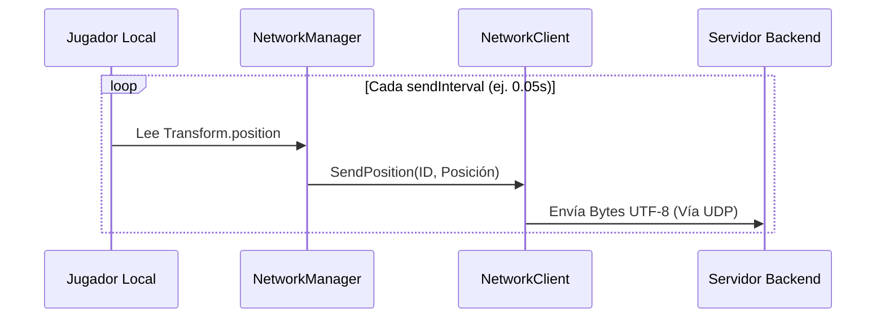

# Documentación Técnica: Sistema de Red Modular UDP

Este módulo implementa un sistema de red cliente-servidor basado en el protocolo **UDP** para el intercambio de posiciones de jugadores en tiempo real dentro de Unity.

Está diseñado bajo el principio de **Responsabilidad Única (SRP)** para mantener una separación clara entre la infraestructura de red, la orquestación de la escena y el control de entidades.

---

## 1. Arquitectura y Componentes

El sistema se compone de tres módulos principales que interactúan de forma desacoplada:

```mermaid
graph TD
    subgraph Servidor
        S[Servidor Backend UDP]
    end
    
    subgraph Cliente Unity - GameObject: NetworkManager
        NC[NetworkClient<br>Sockets / UDP]
        NM[NetworkManager<br>Orquestador de Escena]
        JL[Jugador Local<br>Transform.pos]
        AR[Avatar Remoto<br>Prefab]
        DC[DisableControlsOnRemote]
    end

    S <-->|Payload: ID\|X\|Y\|Z| NC
    NC -- "Event:<br>OnPositionReceived" --> NM
    NM -- "SendPosition()" --> NC
    JL -- "Lee Posición" --> NM
    NM -- "Instancia" --> AR
    NM -- "Aplica a Remotos" --> DC
    DC -.->|Quita controles y<br>física local| AR
```

### Componentes del Sistema

| Componente | Responsabilidad Principal |
| :--- | :--- |
| **`NetworkClient.cs`** | Capa de red pura. Maneja el `UdpClient`, empaqueta datos UTF-8 y transfiere eventos desde el hilo secundario (Sockets) al hilo principal de Unity (*Main Thread Queue*). |
| **`NetworkManager.cs`** | Director de escena. Gestiona la identidad del jugador (`myPlayerId`), el intervalo de envío (`InvokeRepeating`), el registro de jugadores remotos (`Dictionary`) e instanciación de avatares. |
| **`DisableControlsOnRemote.cs`** | Utilitario de configuración de entidad. Desactiva el controlador de entradas/movimiento local (`PlayerMovementController`) y cambia el `Rigidbody2D` a tipo `Kinematic` en los avatares remotos. |

---

## 2. Flujo de Datos

### A. Flujo de Envío (Salida Local)



1. `NetworkManager` lee la posición del `Transform` del jugador local cada intervalo definido (`sendInterval`).
2. Se formatea la información en una cadena serializada: `ID|X|Y|Z`.
3. `NetworkClient` convierte la cadena a `byte[]` en UTF-8 y la envía vía socket UDP a la IP y puerto configurados.

### B. Flujo de Recepción (Entrada Remota)

```mermaid
sequenceDiagram
    participant S as Servidor Backend
    participant NC as NetworkClient
    participant NM as NetworkManager
    participant AR as Avatar Remoto

    S->>NC: UDP Packet (ID|X|Y|Z)
    Note over NC: Hilo Asíncrono (BeginReceive)
    NC->>NC: Encola en MainThreadQueue
    Note over NM: Hilo Principal (Update)
    NC->>NM: Evento OnPositionReceived(id, position)
    
    alt Si el ID es nuevo
        NM->>AR: Instanciar Prefab
        NM->>AR: Llama DisableControlsOnRemote
        Note right of AR: Pasa a Kinematic y desactiva Input
        NM->>NM: Guarda en Diccionario
    else Si el ID ya existe
        NM->>AR: Actualiza Transform.position
    end